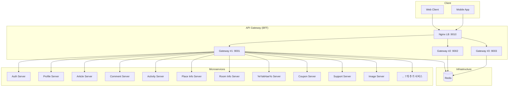
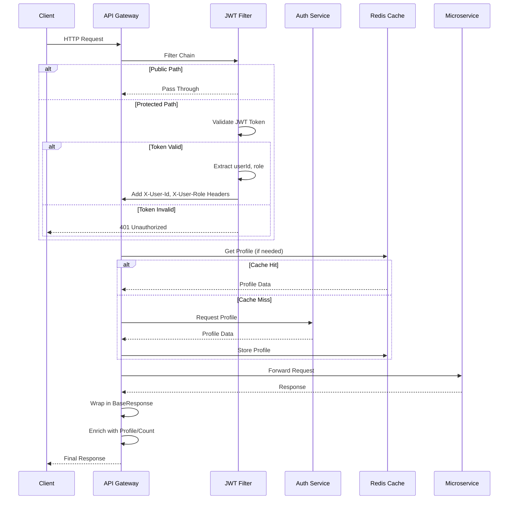
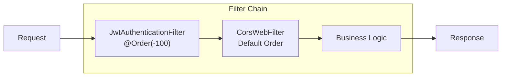
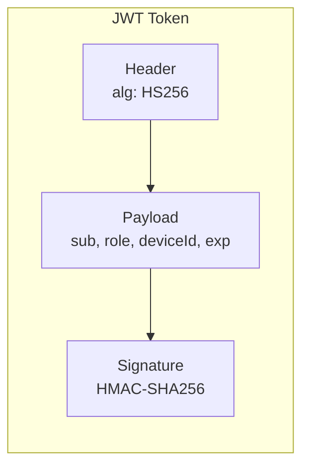
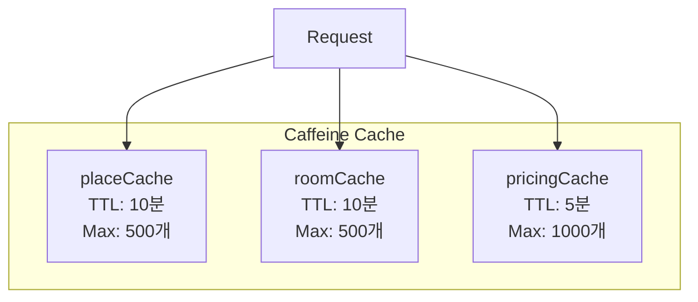

# API Gateway Server

## 1. 개요

API Gateway Server는 **Backend for Frontend (BFF) 패턴** 기반의 Reactive API Gateway입니다. Spring WebFlux를 사용하여 비동기/논블로킹 방식으로
18개의 마이크로서비스를 통합하고, JWT 기반 인증과 데이터 Enrichment를 통해 클라이언트에게 최적화된 API를 제공합니다.

### 주요 기능

| 기능             | 설명                              |
|----------------|---------------------------------|
| 리버스 프록시        | 클라이언트 요청을 각 마이크로서비스로 라우팅        |
| JWT 인증         | 토큰 검증 및 사용자 식별                  |
| 역할 기반 인가       | RBAC(Role-Based Access Control) |
| 데이터 Enrichment | 프로필/카운트 정보 자동 추가                |
| 응답 표준화         | BaseResponse 래퍼로 일관된 형식 제공      |
| 캐싱             | Caffeine(로컬) + Redis(분산) 캐싱     |

### 기술 스택

| 구분            | 기술                                |
|---------------|-----------------------------------|
| Framework     | Spring Boot 3.5.6, Spring WebFlux |
| Language      | Java 21 (Eclipse Temurin)         |
| Build Tool    | Gradle 8.14.3                     |
| Runtime       | Netty (논블로킹 I/O)                  |
| Cache         | Caffeine 3.1.8, Redis             |
| Documentation | SpringDoc OpenAPI 2.8.13          |
| Container     | Docker (멀티아키텍처 지원)                |

---

## 2. 시스템 아키텍처

### 2.1 전체 아키텍처



### 2.2 요청 처리 흐름



### 2.3 필터 체인 구조



---

## 3. 연동 서비스 목록

| 서비스             | 환경변수 (URL/PORT)                               | 용도      |
|-----------------|-----------------------------------------------|---------|
| Auth Server     | AUTH_URL, AUTH_PORT                           | 인증/인가   |
| Profile Server  | PROFILE_URL, PROFILE_PORT                     | 사용자 프로필 |
| Image Server    | IMAGE_URL, IMAGE_PORT                         | 이미지 처리  |
| Article Server  | ARTICLE_URL, ARTICLE_PORT                     | 게시글 관리  |
| Comment Server  | COMMENT_URL, COMMENT_PORT                     | 댓글 관리   |
| Activity Server | ACTIVITY_URL, ACTIVITY_PORT                   | 활동 및 피드 |
| Support Server  | SUPPORT_URL, SUPPORT_PORT                     | 문의/신고   |
| Place Info      | PLACE_INFO_URL, PLACE_INFO_PORT               | 장소 정보   |
| Room Info       | ROOM_INFO_URL, ROOM_INFO_PORT                 | 공간 정보   |
| Gaechu Server   | GAECHU_URL, GAECHU_PORT                       | 좋아요/추천  |
| YeYakHaeYo      | YE_YAK_HAE_YO_URL, YE_YAK_HAE_YO_PORT         | 예약 및 가격 |
| LeeYongGwanLee  | LEE_YONG_GWAN_LEE_URL, LEE_YONG_GWAN_LEE_PORT | 공간 예약   |
| YeYak Manage    | YE_YAK_MANAGE_URL, YE_YAK_MANAGE_PORT         | 예약 관리   |
| Coupon Server   | COUPON_URL, COUPON_PORT                       | 쿠폰 관리   |

---

## 4. API 명세

### 4.1 컨트롤러 및 엔드포인트

| 컨트롤러                       | 경로                            | 설명                 |
|----------------------------|-------------------------------|--------------------|
| AuthController             | `/bff/v1/auth/`               | 로그인, 회원가입, 비밀번호 변경 |
| ProfileController          | `/bff/v1/profiles/`           | 프로필 관리             |
| ArticleController          | `/bff/v1/articles/`           | 게시글 조회/관리          |
| EventController            | `/bff/v1/events/`             | 이벤트 관리             |
| NoticeController           | `/bff/v1/notices/`            | 공지사항               |
| CommentController          | `/bff/v1/comments/`           | 댓글 관리              |
| FeedController             | `/bff/v1/feed/`               | 사용자 피드             |
| PlaceController            | `/bff/v1/places/`             | 장소 조회              |
| RoomController             | `/bff/v1/rooms/`              | 공간 조회              |
| ProductController          | `/bff/v1/products/`           | 상품 관리              |
| ReservationPriceController | `/bff/v1/pricing-policies/`   | 가격 정책              |
| ReservationFieldController | `/bff/v1/room-reservations/`  | 객실 예약              |
| GaechuController           | `/bff/v1/communities/gaechu/` | 좋아요                |
| InquiryController          | `/bff/v1/support/inquiries/`  | 문의                 |
| FaqClient                  | `/bff/v1/support/faq/`        | FAQ                |
| ReportController           | `/bff/v1/support/reports/`    | 신고                 |
| CouponController           | `/bff/v1/coupon/`             | 쿠폰                 |
| EnumsController            | `/bff/v1/enums/`              | Enum 조회            |

### 4.2 Public API (인증 불필요)

```java
// 완전 공개 경로
PUBLIC_PATHS =[
		"/bff/v1/auth",
		"/bff/v1/refreshToken",
		"/actuator/health",
		"/swagger-ui.html",
		"/v3/api-docs"
		]

// GET만 공개 (읽기 전용)
PUBLIC_READ_PATHS =[
		"/bff/v1/profiles",
		"/bff/v1/places",
		"/bff/v1/products",
		"/bff/v1/reviews"
		]
```

### 4.3 공통 응답 포맷

```json
// 성공 응답
{
  "isSuccess": true,
  "code": 200,
  "data": {
    "id": 1,
    "name": "John"
  },
  "request": {
    "path": "/bff/v1/profiles/1"
  }
}

// 에러 응답
{
  "isSuccess": false,
  "code": 401,
  "data": "유효하지 않은 토큰입니다",
  "request": {
    "path": "/bff/v1/auth"
  }
}
```

---

## 5. 인증/인가

### 5.1 JWT 토큰 구조



### 5.2 토큰 클레임

| 클레임      | 설명            | 예시                             |
|----------|---------------|--------------------------------|
| sub      | 사용자 ID        | "user_123"                     |
| role     | 역할            | "USER", "ADMIN", "PLACE_OWNER" |
| deviceId | 디바이스 ID       | "device_abc"                   |
| exp      | 만료 시간 (epoch) | 1672531200                     |

### 5.3 토큰 검증 결과

| 상태                | 설명        |
|-------------------|-----------|
| VALID             | 유효한 토큰    |
| EXPIRED           | 토큰 만료     |
| INVALID_SIGNATURE | 서명 불일치    |
| MALFORMED         | 형식 오류     |
| MISSING_CLAIMS    | 필수 클레임 누락 |
| INVALID_FORMAT    | JWT 형식 아님 |

### 5.4 역할 기반 접근 제어

```java
public enum Role {
	USER,           // 일반 사용자
	ADMIN,          // 관리자
	GUEST,          // 게스트 (미인증)
	PLACE_OWNER     // 장소 소유자
}
```

---

## 6. 캐싱 전략

### 6.1 Caffeine 로컬 캐시



### 6.2 Redis 분산 캐시

| 캐시            | TTL         | 용도                |
|---------------|-------------|-------------------|
| Profile Cache | 3600초 (1시간) | 게시글/댓글 작성자 프로필 정보 |

---

## 7. 에러 코드

| HTTP Status | 설명                    | 사용 케이스    |
|-------------|-----------------------|-----------|
| 400         | Bad Request           | 유효성 검증 실패 |
| 401         | Unauthorized          | 인증 실패     |
| 403         | Forbidden             | 권한 없음     |
| 404         | Not Found             | 리소스 없음    |
| 500         | Internal Server Error | 서버 내부 오류  |

---

## 8. CORS 설정

### 개발 환경

```yaml
cors:
  allowed-origins: "*"
```

### 프로덕션 환경

```yaml
cors:
  allowed-origins: "https://admin.bander.com,https://www.bander.com"
```

| 설정      | 값                                      |
|---------|----------------------------------------|
| 허용 메서드  | GET, POST, PUT, DELETE, OPTIONS, PATCH |
| 자격증명 허용 | true                                   |
| Max Age | 3600초                                  |

---

## 9. 패키지 구조

```
src/main/java/com/study/api_gateway/
├── ApiGatewayApplication.java          # 메인 클래스
├── config/                             # 설정 클래스
│   ├── SecurityFilterConfig.java        # JWT 필터 등록
│   ├── AuthorizationConfig.java         # 권한 설정
│   ├── WebClientConfig.java             # WebClient Bean 설정
│   ├── WebFluxCorsConfig.java           # CORS 설정
│   ├── CacheConfig.java                 # Caffeine 캐시 설정
│   ├── RedisConfig.java                 # Redis 설정
│   ├── OpenApiConfig.java               # Swagger 설정
│   └── GlobalExceptionHandler.java      # 예외 핸들링
├── controller/                         # REST 컨트롤러
│   ├── auth/                            # 인증 API
│   ├── profile/                         # 프로필 API
│   ├── article/                         # 게시글 API
│   ├── comment/                         # 댓글 API
│   ├── activity/                        # 피드 API
│   ├── support/                         # 지원 (문의/신고)
│   ├── placeAndRoom/                    # 장소/공간
│   ├── product/                         # 상품 API
│   ├── coupon/                          # 쿠폰 API
│   ├── gaechu/                          # 좋아요 API
│   └── enums/                           # Enum 조회
├── client/                             # WebClient 클라이언트 (18개)
├── dto/                                # Data Transfer Objects
├── filter/                             # 웹 필터
│   └── JwtAuthenticationFilter.java
├── util/                               # 유틸리티
│   ├── JwtTokenValidator.java           # JWT 검증 로직
│   ├── ResponseFactory.java             # 응답 생성 팩토리
│   └── cache/                           # 캐시 관련
└── exception/                          # 커스텀 예외
```

---

## 10. 환경 설정

### 10.1 환경변수

| 변수                            | 설명            | 기본값       |
|-------------------------------|---------------|-----------|
| SERVER_PORT                   | 서버 포트         | 9001      |
| JWT_SECRET                    | JWT 비밀키       | -         |
| JWT_ACCESS_TOKEN_EXPIRE_TIME  | 액세스 토큰 만료(분)  | 30        |
| JWT_REFRESH_TOKEN_EXPIRE_TIME | 리프레시 토큰 만료(분) | 10080     |
| REDIS_HOST                    | Redis 호스트     | localhost |
| REDIS_PORT                    | Redis 포트      | 6379      |
| PROFILE_CACHE_TTL_SECONDS     | 프로필 캐시 TTL    | 3600      |

### 10.2 application.yaml

```yaml
spring:
  profiles:
    active: dev
  data:
    redis:
      host: ${REDIS_HOST}
      port: ${REDIS_PORT}

security:
  jwt:
    secret: ${JWT_SECRET}
    access-token-expire-time: ${JWT_ACCESS_TOKEN_EXPIRE_TIME:30}
    refresh-token-expire-time: ${JWT_REFRESH_TOKEN_EXPIRE_TIME:10080}

springdoc:
  api-docs:
    path: /v3/api-docs
  swagger-ui:
    path: /swagger-ui.html
```

---

## 11. 배포

### 11.1 Docker 빌드

```bash
# 멀티아키텍처 이미지 빌드
./build-multiarch.sh
```

### 11.2 Docker Compose

```yaml
services:
  gateway-server:
    image: api-gateway:latest
    deploy:
      replicas: 3
    healthcheck:
      test: [ "CMD", "curl", "-f", "http://localhost:9001/actuator/health" ]
      interval: 15s
      timeout: 10s
      retries: 3

  nginx:
    image: nginx:alpine
    ports:
      - "9010:80"
    depends_on:
      - gateway-server
```

### 11.3 포트 정보

| 환경              | 주소                                    |
|-----------------|---------------------------------------|
| 개발              | http://localhost:9001                 |
| Swagger UI      | http://localhost:9001/swagger-ui.html |
| 프로덕션 (Nginx LB) | http://teambind.co.kr:9010            |

---

## 12. 모니터링

### Health Check

```http
GET /actuator/health
```

### 로깅

- SLF4J + Logback
- Docker json-file 드라이버 (Max: 50MB, 3개 파일)
- 1일 이상 로그 자동 정리

---

## 13. 구현 상태

### 완료

- [x] Spring WebFlux 기반 비동기 처리
- [x] JWT 토큰 검증 필터
- [x] CORS 설정
- [x] Caffeine 로컬 캐싱
- [x] Redis 연동
- [x] OpenAPI/Swagger 문서화
- [x] 공통 응답 포맷 (BaseResponse)
- [x] 전역 예외 핸들링
- [x] 18개 다운스트림 서비스 WebClient 통합
- [x] Docker 멀티아키텍처 빌드

### 미완료

- [ ] Rate Limiting
- [ ] Circuit Breaker (Resilience4j)
- [ ] 분산 트레이싱 (Spring Cloud Sleuth)
- [ ] 권한 검증 규칙 구체화

---

## 14. API 문서

- **Swagger UI**: http://localhost:9001/swagger-ui.html
- **OpenAPI Spec**: http://localhost:9001/v3/api-docs
