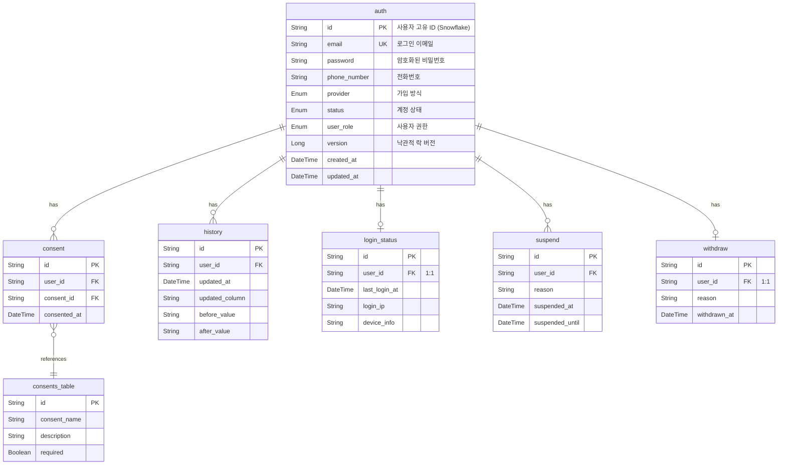
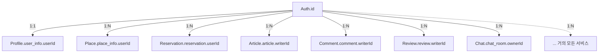

# Auth 도메인 (인증/사용자)

> 사용자 인증, 회원가입, 로그인 상태 관리를 담당하는 핵심 서비스

## 개요

| 항목     | 값                                 |
|--------|-----------------------------------|
| 서비스명   | Auth_Server                       |
| 데이터베이스 | PostgreSQL                        |
| 특징     | 모든 서비스에서 `userId`로 이 서비스의 사용자를 참조 |

---

## ERD



---

## 테이블 상세

### auth (사용자 계정)

> 핵심 테이블 - 모든 서비스에서 이 테이블의 `id`를 `userId`로 참조

| 필드             | 타입       | Null | 설명                     |
|----------------|----------|:----:|------------------------|
| `id`           | String   |  N   | 사용자 고유 ID (Snowflake)  |
| `email`        | String   |  N   | 로그인 이메일 (unique)       |
| `password`     | String   |  Y   | 암호화된 비밀번호 (LOCAL 가입시만) |
| `phone_number` | String   |  Y   | 전화번호                   |
| `provider`     | Enum     |  N   | 가입 방식                  |
| `status`       | Enum     |  N   | 계정 상태                  |
| `user_role`    | Enum     |  N   | 사용자 권한                 |
| `version`      | Long     |  N   | 낙관적 락 버전               |
| `created_at`   | DateTime |  N   | 가입일시                   |
| `updated_at`   | DateTime |  N   | 수정일시                   |

#### Enum: provider

| 값        | 설명          |
|----------|-------------|
| `LOCAL`  | 이메일/비밀번호 가입 |
| `KAKAO`  | 카카오 소셜 로그인  |
| `GOOGLE` | 구글 소셜 로그인   |
| `APPLE`  | 애플 소셜 로그인   |

#### Enum: status

| 값           | 설명    |
|-------------|-------|
| `ACTIVE`    | 정상 계정 |
| `INACTIVE`  | 비활성화  |
| `SUSPENDED` | 정지됨   |
| `WITHDRAWN` | 탈퇴함   |

#### Enum: user_role

| 값             | 설명     |
|---------------|--------|
| `USER`        | 일반 사용자 |
| `PLACE_OWNER` | 업체 소유자 |
| `ADMIN`       | 관리자    |

---

### consent (사용자 동의 기록)

| 필드             | 타입       | Null | 설명                             |
|----------------|----------|:----:|--------------------------------|
| `id`           | String   |  N   | 동의 기록 ID                       |
| `user_id`      | String   |  N   | 사용자 ID (→ auth.id)             |
| `consent_id`   | String   |  N   | 동의 항목 ID (→ consents_table.id) |
| `consented_at` | DateTime |  N   | 동의 일시                          |

---

### consents_table (동의 항목 정의)

| 필드             | 타입      | Null | 설명       |
|----------------|---------|:----:|----------|
| `id`           | String  |  N   | 동의 항목 ID |
| `consent_name` | String  |  N   | 동의 항목명   |
| `description`  | String  |  Y   | 상세 설명    |
| `required`     | Boolean |  N   | 필수 동의 여부 |

---

### history (계정 변경 이력)

| 필드               | 타입       | Null | 설명                 |
|------------------|----------|:----:|--------------------|
| `id`             | String   |  N   | 이력 ID              |
| `user_id`        | String   |  N   | 사용자 ID (→ auth.id) |
| `updated_at`     | DateTime |  N   | 변경 일시              |
| `updated_column` | String   |  N   | 변경된 필드명            |
| `before_value`   | String   |  Y   | 변경 전 값             |
| `after_value`    | String   |  Y   | 변경 후 값             |

---

### login_status (로그인 상태)

| 필드              | 타입       | Null | 설명                      |
|-----------------|----------|:----:|-------------------------|
| `id`            | String   |  N   | 상태 ID                   |
| `user_id`       | String   |  N   | 사용자 ID (→ auth.id, 1:1) |
| `last_login_at` | DateTime |  Y   | 마지막 로그인                 |
| `login_ip`      | String   |  Y   | 로그인 IP                  |
| `device_info`   | String   |  Y   | 디바이스 정보                 |

---

### suspend (계정 정지)

| 필드                | 타입       | Null | 설명                 |
|-------------------|----------|:----:|--------------------|
| `id`              | String   |  N   | 정지 ID              |
| `user_id`         | String   |  N   | 사용자 ID (→ auth.id) |
| `reason`          | String   |  N   | 정지 사유              |
| `suspended_at`    | DateTime |  N   | 정지 시작일             |
| `suspended_until` | DateTime |  Y   | 정지 종료일 (null=영구)   |

---

### withdraw (회원 탈퇴)

| 필드             | 타입       | Null | 설명                      |
|----------------|----------|:----:|-------------------------|
| `id`           | String   |  N   | 탈퇴 ID                   |
| `user_id`      | String   |  N   | 사용자 ID (→ auth.id, 1:1) |
| `reason`       | String   |  Y   | 탈퇴 사유                   |
| `withdrawn_at` | DateTime |  N   | 탈퇴 일시                   |

---

## API Response

### LoginResponse (로그인 성공)

```json
{
  "accessToken": "eyJhbGciOiJIUzI1NiIsInR5cCI6IkpXVCJ9...",
  "refreshToken": "eyJhbGciOiJIUzI1NiIsInR5cCI6IkpXVCJ9...",
  "deviceId": "device-123"
}
```

| 필드             | 타입     | 설명          |
|----------------|--------|-------------|
| `accessToken`  | String | JWT 액세스 토큰  |
| `refreshToken` | String | JWT 리프레시 토큰 |
| `deviceId`     | String | 디바이스 식별자    |

---

### SimpleAuthResponse (사용자 정보)

```json
{
  "userId": "1234567890123456789",
  "status": "ACTIVE",
  "provider": "KAKAO",
  "createdAt": "2026-01-12T10:00:00",
  "updatedAt": "2026-01-12T10:00:00"
}
```

| 필드          | 타입       | 설명                                             |
|-------------|----------|------------------------------------------------|
| `userId`    | String   | 사용자 ID                                         |
| `status`    | Enum     | 계정 상태 (ACTIVE, INACTIVE, SUSPENDED, WITHDRAWN) |
| `provider`  | Enum     | 가입 방식 (LOCAL, KAKAO, GOOGLE, APPLE)            |
| `createdAt` | DateTime | 가입일시                                           |
| `updatedAt` | DateTime | 수정일시                                           |

---

## 다른 서비스와의 관계



---

