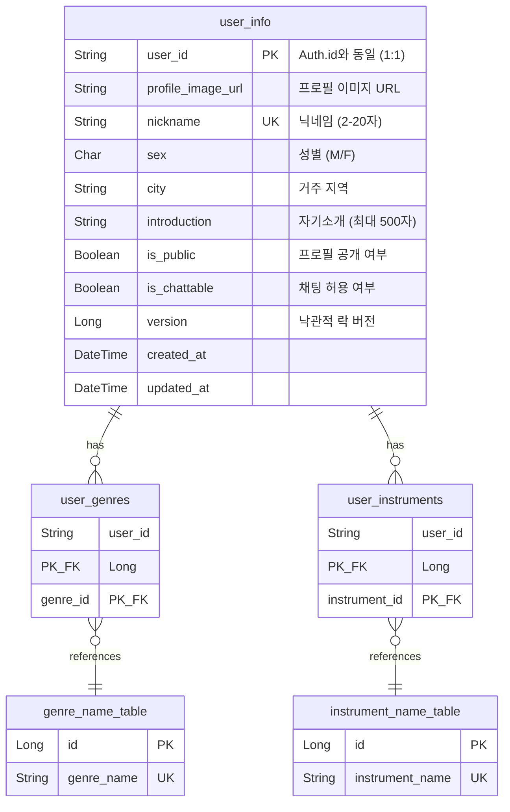

# Profile 도메인 (프로필)

> 사용자의 공개 프로필, 음악 장르, 악기 정보를 관리하는 서비스

## 개요

| 항목     | 값                   |
|--------|---------------------|
| 서비스명   | Profile-Server      |
| 데이터베이스 | PostgreSQL          |
| 특징     | Auth.userId와 1:1 관계 |

---

## ERD



---

## 테이블 상세

### user_info (사용자 프로필)

| 필드                  | 타입        | Null | 설명                  | 예시                                          |
|---------------------|-----------|:----:|---------------------|---------------------------------------------|
| `user_id`           | String    |  N   | PK, Auth.id와 동일     | `"u1"`                                      |
| `profile_image_url` | String    |  Y   | 프로필 이미지 URL         | `"https://cdn.example.com/profiles/u1.png"` |
| `nickname`          | String    |  N   | 닉네임 (unique, 2-20자) | `"딩주"`                                      |
| `sex`               | Character |  Y   | 성별                  | `'M'` or `'F'`                              |
| `city`              | String    |  Y   | 거주 지역               | `"SEOUL"`                                   |
| `introduction`      | String    |  Y   | 자기소개 (최대 500자)      | `"안녕하세요!"`                                  |
| `is_public`         | Boolean   |  N   | 프로필 공개 여부           | `true`                                      |
| `is_chattable`      | Boolean   |  N   | 채팅 허용 여부            | `true`                                      |
| `version`           | Long      |  N   | 낙관적 락 버전            | `1`                                         |
| `created_at`        | DateTime  |  N   | 생성일시                |                                             |
| `updated_at`        | DateTime  |  N   | 수정일시                |                                             |

---

### user_genres (사용자 선호 장르)

| 필드         | 타입     | Null | 설명            |
|------------|--------|:----:|---------------|
| `user_id`  | String |  N   | 복합 PK, 사용자 ID |
| `genre_id` | Long   |  N   | 복합 PK, 장르 ID  |

---

### genre_name_table (장르 마스터)

| 필드           | 타입     | Null | 설명           | 예시       |
|--------------|--------|:----:|--------------|----------|
| `id`         | Long   |  N   | 장르 ID        | `1`      |
| `genre_name` | String |  N   | 장르명 (unique) | `"ROCK"` |

**장르 목록**: `ROCK`, `JAZZ`, `POP`, `CLASSICAL`, `HIPHOP`, `R&B`, `ELECTRONIC`, `FOLK`, `METAL`, `BLUES`

---

### user_instruments (사용자 연주 악기)

| 필드              | 타입     | Null | 설명            |
|-----------------|--------|:----:|---------------|
| `user_id`       | String |  N   | 복합 PK, 사용자 ID |
| `instrument_id` | Long   |  N   | 복합 PK, 악기 ID  |

---

### instrument_name_table (악기 마스터)

| 필드                | 타입     | Null | 설명           | 예시         |
|-------------------|--------|:----:|--------------|------------|
| `id`              | Long   |  N   | 악기 ID        | `1`        |
| `instrument_name` | String |  N   | 악기명 (unique) | `"GUITAR"` |

**악기 목록**: `GUITAR`, `BASS`, `DRUM`, `KEYBOARD`, `PIANO`, `VOCAL`, `VIOLIN`, `CELLO`, `SAXOPHONE`, `TRUMPET`

---

## API Response

### UserResponse (프로필 조회)

```json
{
  "userId": "u1",
  "sex": "M",
  "profileImageUrl": "https://cdn.example.com/profiles/u1.png",
  "genres": ["ROCK", "JAZZ"],
  "instruments": ["GUITAR", "BASS"],
  "city": "SEOUL",
  "nickname": "딩주",
  "isChattable": true,
  "isPublic": true,
  "introduction": "안녕하세요!"
}
```

| 필드                | 타입             | Null | 설명              |
|-------------------|----------------|:----:|-----------------|
| `userId`          | String         |  N   | 사용자 ID          |
| `sex`             | Character      |  Y   | 성별 (`M` or `F`) |
| `profileImageUrl` | String         |  Y   | 프로필 이미지 URL     |
| `genres`          | List\<String\> |  Y   | 선호 장르 목록        |
| `instruments`     | List\<String\> |  Y   | 연주 악기 목록        |
| `city`            | String         |  Y   | 활동 지역           |
| `nickname`        | String         |  N   | 닉네임             |
| `isChattable`     | Boolean        |  N   | 채팅 가능 여부        |
| `isPublic`        | Boolean        |  N   | 프로필 공개 여부       |
| `introduction`    | String         |  Y   | 자기소개            |

---

