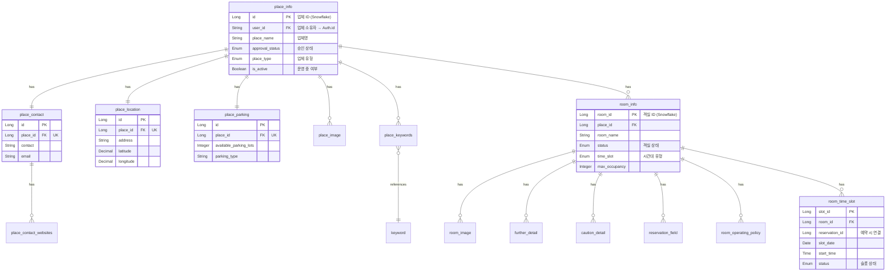

# Place & Room 도메인 (업체/공간)

> 합주실, 연습실 등 업체 정보와 공간 정보를 관리하는 서비스

## 개요

- **서비스명**:
	- PLACE_INFO_SERVICE_SERVER (업체 정보)
	- ROOM_INFO_SERVICE_SERVER (객실 정보)
	- LEE_YONG_GWAN_LEE_SERVICE_SERVER (운영 정책/타임슬롯)
- **데이터베이스**: PostgreSQL
- **특징**: Place → Room → TimeSlot 순으로 계층 구조

---

## 전체 구조



---

## PLACE 테이블 상세

### place_info (업체 정보)

> 합주실/연습실 업체의 기본 정보. DDD의 Aggregate Root

| 필드                    | 타입       | 필수 | 설명                 | 예시 값                     |
|-----------------------|----------|:--:|--------------------|--------------------------|
| `id`                  | Long     | O  | 업체 ID (Snowflake)  | `1234567890`             |
| `user_id`             | String   | O  | 업체 소유자 (→ Auth.id) | `"user123..."`           |
| `place_name`          | String   | O  | 업체명                | `"밴더 합주실 홍대점"`           |
| `description`         | String   | X  | 업체 소개 (최대 2000자)   | `"24시간 운영되는..."`         |
| `category`            | String   | O  | 업체 카테고리            | `"합주실"`                  |
| `place_type`          | String   | O  | 업체 유형              | `"BAND_PRACTICE"`        |
| `is_active`           | Boolean  | O  | 운영 중 여부            | `true`                   |
| `approval_status`     | Enum     | O  | 승인 상태              | `"APPROVED"`             |
| `registration_status` | Enum     | O  | 등록 상태              | `"COMPLETED"`            |
| `rating_average`      | Decimal  | O  | 평균 평점 (1.0~5.0)    | `4.5`                    |
| `review_count`        | Int      | O  | 리뷰 수               | `127`                    |
| `created_at`          | DateTime | O  | 등록일시               | `"2026-01-12T10:00:00Z"` |
| `updated_at`          | DateTime | O  | 수정일시               | `"2026-01-12T10:00:00Z"` |
| `deleted_at`          | DateTime | X  | 삭제일시 (Soft Delete) | `null`                   |

#### Enum 값

**approval_status (승인 상태)**

| 값        | 설명    | 앱에서 노출 |
|----------|-------|--------|
| PENDING  | 승인 대기 | X      |
| APPROVED | 승인됨   | O      |
| REJECTED | 거절됨   | X      |

**place_type (업체 유형)**

| 값                | 설명     |
|------------------|--------|
| BAND_PRACTICE    | 밴드 합주실 |
| VOCAL_PRACTICE   | 보컬 연습실 |
| RECORDING_STUDIO | 녹음실    |
| DANCE_STUDIO     | 댄스 연습실 |

---

### place_contact (업체 연락처)

> 업체와 1:1 관계. 연락처 정보

| 필드         | 타입     | 필수 | 설명                           | 예시 값                |
|------------|--------|:--:|------------------------------|---------------------|
| `id`       | Long   | O  | PK (auto increment)          | `1`                 |
| `place_id` | Long   | O  | 업체 ID (→ place_info.id, 1:1) | `1234567890`        |
| `contact`  | String | O  | 대표 전화번호                      | `"02-1234-5678"`    |
| `email`    | String | X  | 이메일                          | `"info@bander.com"` |

### place_contact_websites (웹사이트 목록)

> 업체의 웹사이트 URL 목록 (최대 10개)

| 필드                 | 타입     | 설명       | 예시 값                   |
|--------------------|--------|----------|------------------------|
| `place_contact_id` | Long   | 연락처 ID   | `1`                    |
| `website`          | String | 웹사이트 URL | `"https://bander.com"` |

---

### place_location (업체 위치)

> 업체와 1:1 관계. 주소 및 좌표

| 필드          | 타입      | 필수 | 설명          | 예시 값                  |
|-------------|---------|:--:|-------------|-----------------------|
| `id`        | Long    | O  | PK          | `1`                   |
| `place_id`  | Long    | O  | 업체 ID (1:1) | `1234567890`          |
| `address`   | String  | O  | 도로명 주소      | `"서울특별시 마포구 홍대로 123"` |
| `latitude`  | Decimal | O  | 위도          | `37.5565`             |
| `longitude` | Decimal | O  | 경도          | `126.9239`            |

---

### place_parking (주차 정보)

> 업체와 1:1 관계. 주차 가능 여부

| 필드                       | 타입     | 필수 | 설명          | 예시 값                           |
|--------------------------|--------|:--:|-------------|--------------------------------|
| `id`                     | Long   | O  | PK          | `1`                            |
| `place_id`               | Long   | O  | 업체 ID (1:1) | `1234567890`                   |
| `available_parking_lots` | Int    | O  | 주차 가능 대수    | `10`                           |
| `parking_type`           | String | O  | 주차 유형       | `"FREE"` / `"PAID"` / `"NONE"` |

---

### place_image (업체 이미지)

> 업체와 1:N 관계. 최대 10개

| 필드          | 타입     | 필수 | 설명          | 예시 값                          |
|-------------|--------|:--:|-------------|-------------------------------|
| `image_id`  | Long   | O  | PK          | `1`                           |
| `place_id`  | Long   | O  | 업체 ID       | `1234567890`                  |
| `image_url` | String | O  | 이미지 URL     | `"https://cdn.../place1.jpg"` |
| `sequence`  | Int    | O  | 표시 순서 (0부터) | `0`                           |

---

### place_keywords (업체 키워드)

> 업체 검색용 키워드 (M:N 관계)

| 필드           | 타입   | 설명     |
|--------------|------|--------|
| `place_id`   | Long | 업체 ID  |
| `keyword_id` | Long | 키워드 ID |

**주요 키워드**
| ID | 키워드명 |
|----|---------|
| 1 | 24시간 |
| 2 | 주차가능 |
| 3 | 역근처 |
| 4 | 장비대여 |
| 5 | 녹음가능 |

---

## ROOM 테이블 상세

### room_info (객실 정보)

> 업체 내 개별 방(객실) 정보

| 필드              | 타입       | 필수 | 설명                      | 예시 값                     |
|-----------------|----------|:--:|-------------------------|--------------------------|
| `room_id`       | Long     | O  | 객실 ID (Snowflake)       | `9876543210`             |
| `place_id`      | Long     | O  | 업체 ID (→ place_info.id) | `1234567890`             |
| `room_name`     | String   | O  | 객실명                     | `"A룸"`                   |
| `status`        | Enum     | O  | 객실 상태                   | `"ACTIVE"`               |
| `time_slot`     | Enum     | O  | 시간대 유형                  | `"HOURLY"`               |
| `max_occupancy` | Int      | O  | 최대 수용 인원                | `6`                      |
| `created_at`    | DateTime | O  | 등록일시                    | `"2026-01-12T10:00:00Z"` |
| `updated_at`    | DateTime | O  | 수정일시                    | `"2026-01-12T10:00:00Z"` |

#### Enum 값

**status (RoomStatus - 객실 상태)**

| 값       | 설명    |
|---------|-------|
| OPEN    | 운영 중  |
| CLOSE   | 운영 종료 |
| PENDING | 승인 대기 |

**time_slot (TimeSlot - 예약 시간 단위)**

| 값        | 설명          |
|----------|-------------|
| HOUR     | 시간 단위 (1시간) |
| HALFHOUR | 30분 단위      |

---

### room_image (객실 이미지)

| 필드          | 타입     | 필수 | 설명      | 예시 값                         |
|-------------|--------|:--:|---------|------------------------------|
| `image_id`  | Long   | O  | PK      | `1`                          |
| `room_id`   | Long   | O  | 객실 ID   | `9876543210`                 |
| `image_url` | String | O  | 이미지 URL | `"https://cdn.../room1.jpg"` |
| `sequence`  | Int    | O  | 표시 순서   | `0`                          |

---

### further_detail (추가 정보)

> 객실의 부가 설명

| 필드        | 타입     | 설명    | 예시 값         |
|-----------|--------|-------|--------------|
| `id`      | Long   | PK    | `1`          |
| `room_id` | Long   | 객실 ID | `9876543210` |
| `detail`  | String | 상세 내용 | `"드럼 세트 포함"` |

---

### caution_detail (주의사항)

> 객실 이용 시 주의사항

| 필드        | 타입     | 설명    | 예시 값          |
|-----------|--------|-------|---------------|
| `id`      | Long   | PK    | `1`           |
| `room_id` | Long   | 객실 ID | `9876543210`  |
| `detail`  | String | 주의사항  | `"음식물 반입 금지"` |

---

### reservation_field (예약 시 입력 필드)

> 예약할 때 사용자가 입력해야 하는 필드 정의

| 필드           | 타입      | 필수 | 설명    | 예시 값         |
|--------------|---------|:--:|-------|--------------|
| `field_id`   | Long    | O  | PK    | `1`          |
| `room_id`    | Long    | O  | 객실 ID | `9876543210` |
| `title`      | String  | O  | 필드 라벨 | `"인원수"`      |
| `input_type` | Enum    | O  | 입력 타입 | `"NUMBER"`   |
| `required`   | Boolean | O  | 필수 여부 | `true`       |
| `max_length` | Int     | X  | 최대 길이 | `100`        |
| `sequence`   | Int     | O  | 표시 순서 | `0`          |

**input_type (입력 타입)**

| 값        | 설명      |
|----------|---------|
| TEXT     | 텍스트 입력  |
| NUMBER   | 숫자 입력   |
| DATE     | 날짜 선택   |
| SELECT   | 드롭다운 선택 |
| CHECKBOX | 체크박스    |

---

## TIMESLOT 테이블 상세

### room_operating_policy (운영 정책)

> 객실별 요일/시간대 운영 정책

| 필드            | 타입      | 필수 | 설명    | 예시 값         |
|---------------|---------|:--:|-------|--------------|
| `id`          | Long    | O  | PK    | `1`          |
| `room_id`     | Long    | O  | 객실 ID | `9876543210` |
| `day_of_week` | String  | O  | 요일    | `"MONDAY"`   |
| `start_time`  | Time    | O  | 시작 시간 | `"09:00"`    |
| `end_time`    | Time    | O  | 종료 시간 | `"22:00"`    |
| `is_active`   | Boolean | O  | 운영 여부 | `true`       |

---

### room_time_slot (예약 가능 타임슬롯)

> 실제 예약 가능한 시간 슬롯 (동적 생성)

| 필드               | 타입   | 필수 | 설명          | 예시 값               |
|------------------|------|:--:|-------------|--------------------|
| `slot_id`        | Long | O  | PK          | `1`                |
| `room_id`        | Long | O  | 객실 ID       | `9876543210`       |
| `reservation_id` | Long | X  | 예약 ID (예약됨) | `null` or `555...` |
| `slot_date`      | Date | O  | 슬롯 날짜       | `"2026-01-15"`     |
| `start_time`     | Time | O  | 시작 시간       | `"14:00"`          |
| `end_time`       | Time | O  | 종료 시간       | `"15:00"`          |
| `status`         | Enum | O  | 슬롯 상태       | `"AVAILABLE"`      |

**status (SlotStatus - 슬롯 상태)**

| 값           | 설명              |
|-------------|-----------------|
| `AVAILABLE` | 예약 가능 상태 또는 취소됨 |
| `PENDING`   | 예약 진행중 (결제 대기)  |
| `RESERVED`  | 예약 확정 (결제 완료)   |
| `CLOSED`    | 운영하지 않음 (휴무일)   |

---

## API Response 예시

### 업체 목록 조회

```json
{
  "success": true,
  "data": {
    "content": [
      {
        "id": 1234567890,
        "placeName": "밴더 합주실 홍대점",
        "category": "합주실",
        "thumbnailUrl": "https://cdn.../place1.jpg",
        "address": "서울특별시 마포구 홍대로 123",
        "ratingAverage": 4.5,
        "reviewCount": 127,
        "keywords": ["24시간", "주차가능", "역근처"],
        "distance": 1.2
      }
    ],
    "page": 0,
    "size": 20,
    "totalElements": 50,
    "hasNext": true
  }
}
```

### 업체 상세 조회

```json
{
  "success": true,
  "data": {
    "id": 1234567890,
    "placeName": "밴더 합주실 홍대점",
    "description": "24시간 운영되는 프리미엄 합주실입니다.",
    "category": "합주실",
    "placeType": "BAND_PRACTICE",
    "isActive": true,
    "ratingAverage": 4.5,
    "reviewCount": 127,
    "contact": {
      "phone": "02-1234-5678",
      "email": "hongdae@bander.com",
      "websites": ["https://bander.com"]
    },
    "location": {
      "address": "서울특별시 마포구 홍대로 123",
      "latitude": 37.5565,
      "longitude": 126.9239
    },
    "parking": {
      "availableLots": 10,
      "type": "FREE"
    },
    "images": [
      { "url": "https://cdn.../place1.jpg", "sequence": 0 },
      { "url": "https://cdn.../place2.jpg", "sequence": 1 }
    ],
    "keywords": ["24시간", "주차가능", "역근처"],
    "rooms": [
      {
        "roomId": 9876543210,
        "roomName": "A룸",
        "maxOccupancy": 6,
        "thumbnailUrl": "https://cdn.../roomA.jpg"
      },
      {
        "roomId": 9876543211,
        "roomName": "B룸",
        "maxOccupancy": 4,
        "thumbnailUrl": "https://cdn.../roomB.jpg"
      }
    ]
  }
}
```

### 객실 상세 조회

```json
{
  "success": true,
  "data": {
    "roomId": 9876543210,
    "placeId": 1234567890,
    "roomName": "A룸",
    "status": "ACTIVE",
    "timeSlotType": "HOURLY",
    "maxOccupancy": 6,
    "images": [
      { "url": "https://cdn.../roomA1.jpg", "sequence": 0 },
      { "url": "https://cdn.../roomA2.jpg", "sequence": 1 }
    ],
    "furtherDetails": [
      "드럼 세트 포함",
      "앰프 2대 구비",
      "에어컨 완비"
    ],
    "cautions": [
      "음식물 반입 금지",
      "22시 이후 소음 주의"
    ],
    "reservationFields": [
      {
        "fieldId": 1,
        "title": "인원수",
        "inputType": "NUMBER",
        "required": true
      },
      {
        "fieldId": 2,
        "title": "요청사항",
        "inputType": "TEXT",
        "required": false,
        "maxLength": 200
      }
    ]
  }
}
```

### AvailableSlotResponse (예약 가능 슬롯)

```json
{
  "slotId": 12345,
  "roomId": 101,
  "slotDate": "2025-01-20",
  "slotTime": "09:00",
  "status": "AVAILABLE"
}
```

| 필드       | 타입     | 설명                 | 예시           |
|----------|--------|--------------------|--------------|
| slotId   | Long   | 슬롯 ID              | 12345        |
| roomId   | Long   | 룸 ID               | 101          |
| slotDate | String | 슬롯 날짜 (yyyy-MM-dd) | "2025-01-20" |
| slotTime | String | 슬롯 시각 (HH:mm)      | "09:00"      |
| status   | String | 슬롯 상태              | "AVAILABLE"  |

---

## 서비스 간 관계


---

