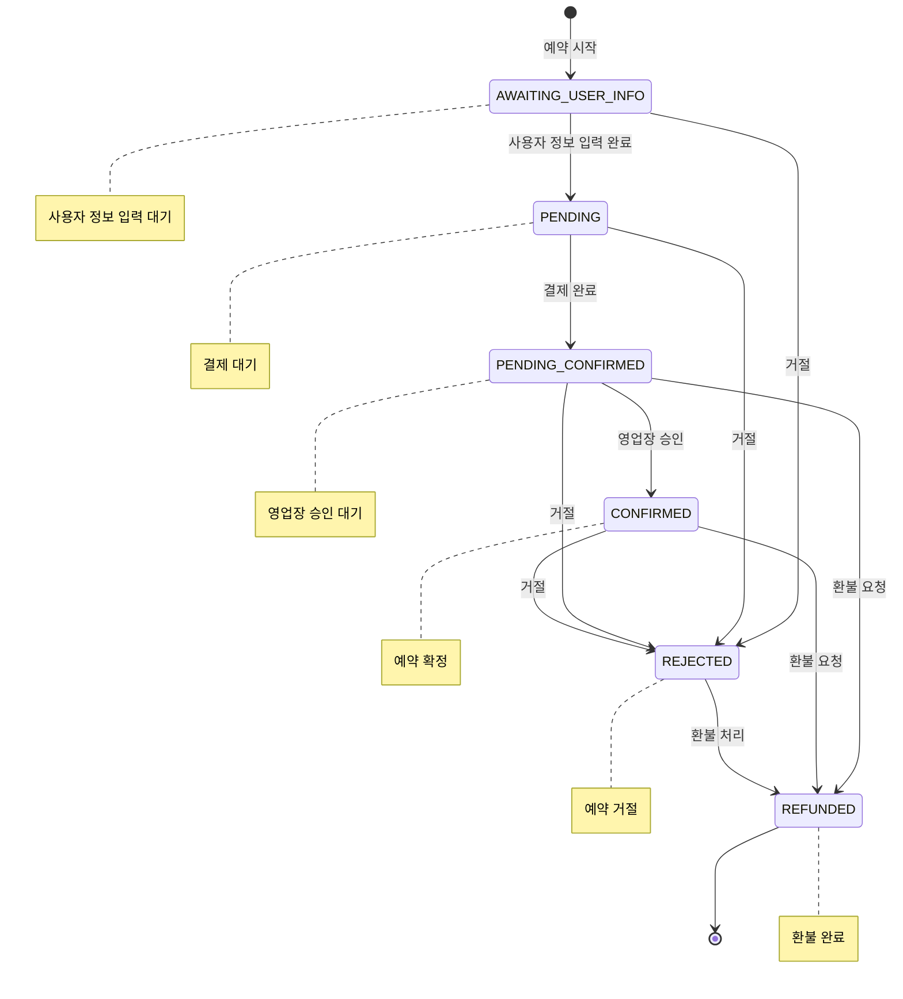

# Reservation/Payment 도메인 (예약/결제)

> 예약 생성, 결제 처리, 환불, 쿠폰 적용을 관리하는 서비스

## 개요

| 서비스명                          | 데이터베이스     | 특징       |
|-------------------------------|------------|----------|
| YE_YAK_MANAGER_SERVICE_SERVER | PostgreSQL | 예약 관리 서버 |
| PAYMENT (TOSS)                | PostgreSQL | 토스 결제 연동 |
| COUPON                        | PostgreSQL | 쿠폰 발급/사용 |

---

## ERD

```mermaid
erDiagram
    reservation_entity ||--o| payments : "has"
    payments ||--o{ refunds : "has"
    coupon_policies ||--o{ coupon_issues : "has"

    reservation_entity {
        Long reservation_id PK "예약 ID (Snowflake)"
        Long place_id FK "업체 ID → Place"
        Long room_id FK "객실 ID → Room"
        Long user_id FK "예약자 ID → Auth"
        Enum status "예약 상태"
        Date reservation_date "예약 날짜"
        JSON start_times "시작 시간들"
        Long total_price "총 가격"
    }

    payments {
        String payment_id PK "결제 ID"
        String reservation_id FK_UK "예약 ID"
        Decimal amount "결제 금액"
        Enum method "결제 수단"
        Enum status "결제 상태"
        String payment_key "토스 결제 키"
        DateTime paid_at "결제 완료 시각"
    }

    refunds {
        String refund_id PK "환불 ID"
        String payment_id FK "결제 ID"
        Decimal refund_amount "환불 금액"
        Enum status "환불 상태"
        DateTime completed_at "완료 시각"
    }

    coupon_policies {
        Long id PK "Snowflake ID"
        String coupon_name "쿠폰명"
        String coupon_code UK "쿠폰 코드"
        Enum discount_type "할인 유형"
        Decimal discount_value "할인 값"
        Enum distribution_type "배포 방식"
    }

    coupon_issues {
        Long id PK "Snowflake ID"
        Long policy_id FK "쿠폰 정책 ID"
        Long user_id FK "사용자 ID → Auth"
        Enum status "쿠폰 상태"
        String reservation_id UK "예약 ID"
        DateTime used_at "사용 시각"
    }
```

---

## 테이블 상세

### reservation_entity (예약)

| 필드                       | 타입             | Null | 설명              | 예시                   |
|--------------------------|----------------|:----:|-----------------|----------------------|
| `reservation_id`         | Long           |  N   | 예약 ID           | `1234567890`         |
| `place_id`               | Long           |  N   | 업체 ID (→ Place) | `100`                |
| `room_id`                | Long           |  N   | 객실 ID (→ Room)  | `200`                |
| `user_id`                | Long           |  N   | 예약자 ID (→ Auth) | `300`                |
| `status`                 | Enum           |  N   | 예약 상태           | `PENDING`            |
| `reservation_date`       | LocalDate      |  N   | 예약 날짜           | `2026-01-15`         |
| `start_times`            | List\<String\> |  Y   | 시작 시간들          | `["10:00", "11:00"]` |
| `total_price`            | Long           |  N   | 총 가격            | `50000`              |
| `reservation_time_price` | Long           |  Y   | 시간 가격           | `40000`              |
| `product_data`           | JSON           |  Y   | 상품 정보           | `{}`                 |
| `additional_info`        | JSON           |  Y   | 추가 정보           | `{}`                 |
| `reserver_name`          | String         |  Y   | 예약자 이름 (암호화)    |                      |
| `reserver_phone`         | String         |  Y   | 예약자 전화번호 (암호화)  |                      |
| `approved_at`            | DateTime       |  Y   | 승인 일시           |                      |
| `approved_by`            | Long           |  Y   | 승인자 ID (0=시스템)  | `0`                  |
| `rejected_at`            | DateTime       |  Y   | 거절 일시           |                      |
| `rejected_reason`        | String         |  Y   | 거절 사유 (최소 5자)   |                      |
| `rejected_by`            | Long           |  Y   | 거절자 ID          |                      |

#### Enum: ReservationStatus (YE_YAK_MANAGER)

| 값                    | 설명            | 전이 가능 상태                      |
|----------------------|---------------|-------------------------------|
| `AWAITING_USER_INFO` | 사용자 정보 입력 대기  | PENDING, REJECTED             |
| `PENDING`            | 예약 대기 (결제 대기) | PENDING_CONFIRMED, REJECTED   |
| `PENDING_CONFIRMED`  | 영업장 승인 대기     | CONFIRMED, REJECTED, REFUNDED |
| `CONFIRMED`          | 예약 확정         | REJECTED, REFUNDED            |
| `REJECTED`           | 예약 거절         | REFUNDED                      |
| `REFUNDED`           | 환불 완료         | (종료 상태)                       |

---

### payments (결제)

| 필드                | 타입          | Null | 설명             | 예시               |
|-------------------|-------------|:----:|----------------|------------------|
| `payment_id`      | String(50)  |  N   | PK, 결제 ID      | `"PAY-ABC12345"` |
| `reservation_id`  | String(50)  |  N   | 예약 ID (unique) | `"1234567890"`   |
| `amount`          | Money       |  N   | 결제 금액          |                  |
| `method`          | Enum        |  Y   | 결제 수단          | `CARD`           |
| `status`          | Enum        |  N   | 결제 상태          | `PREPARED`       |
| `order_id`        | String(100) |  Y   | 주문 ID          |                  |
| `payment_key`     | String(200) |  Y   | 토스 결제 키        |                  |
| `transaction_id`  | String(100) |  Y   | 토스 거래 ID       |                  |
| `check_in_date`   | DateTime    |  N   | 체크인 날짜         |                  |
| `idempotency_key` | String(100) |  Y   | 멱등성 키 (unique) |                  |
| `created_at`      | DateTime    |  N   | 생성 시각          |                  |
| `paid_at`         | DateTime    |  Y   | 결제 완료 시각       |                  |
| `cancelled_at`    | DateTime    |  Y   | 취소 시각          |                  |
| `failure_reason`  | Text        |  Y   | 실패 사유          |                  |

#### Enum: PaymentStatus

| 값           | 설명                        |
|-------------|---------------------------|
| `PREPARED`  | 결제 대기 (Kafka 이벤트로 저장된 상태) |
| `COMPLETED` | 결제 완료 (Toss 승인 완료)        |
| `FAILED`    | 결제 실패                     |
| `CANCELLED` | 결제 취소                     |

#### Enum: PaymentMethod

| 값                 | 설명      |
|-------------------|---------|
| `CARD`            | 신용/체크카드 |
| `VIRTUAL_ACCOUNT` | 가상계좌    |
| `EASY_PAY`        | 간편결제    |

---

### refunds (환불)

| 필드                | 타입          | Null | 설명        | 예시               |
|-------------------|-------------|:----:|-----------|------------------|
| `refund_id`       | String(50)  |  N   | PK, 환불 ID | `"REF-ABC12345"` |
| `payment_id`      | String(50)  |  N   | 결제 ID     |                  |
| `refund_amount`   | Money       |  N   | 환불 금액     |                  |
| `original_amount` | Money       |  N   | 원래 금액     |                  |
| `status`          | Enum        |  N   | 환불 상태     | `PENDING`        |
| `reason`          | Text        |  Y   | 환불 사유     |                  |
| `cancel_reason`   | Text        |  Y   | 취소 사유     |                  |
| `transaction_id`  | String(100) |  Y   | 토스 거래 ID  |                  |
| `requested_at`    | DateTime    |  N   | 요청 시각     |                  |
| `approved_at`     | DateTime    |  Y   | 승인 시각     |                  |
| `completed_at`    | DateTime    |  Y   | 완료 시각     |                  |
| `failure_reason`  | Text        |  Y   | 실패 사유     |                  |

#### Enum: RefundStatus

| 값           | 설명                   |
|-------------|----------------------|
| `PENDING`   | 환불 요청 (검증 대기)        |
| `APPROVED`  | 환불 승인 (Toss 환불 요청 전) |
| `COMPLETED` | 환불 완료 (Toss 환불 완료)   |
| `FAILED`    | 환불 실패                |

---

### coupon_policies (쿠폰 정책)

| 필드                     | 타입          | Null | 설명               | 예시               |
|------------------------|-------------|:----:|------------------|------------------|
| `id`                   | Long        |  N   | PK, Snowflake ID |                  |
| `coupon_name`          | String(100) |  N   | 쿠폰명              | `"신규 가입 10% 할인"` |
| `coupon_code`          | String(50)  |  Y   | 쿠폰 코드 (CODE 타입)  | `"WELCOME2026"`  |
| `description`          | String(500) |  Y   | 설명               |                  |
| `discount_type`        | Enum        |  N   | 할인 유형            | `PERCENTAGE`     |
| `discount_value`       | Decimal     |  N   | 할인 값             | `10.00`          |
| `max_discount_amount`  | Decimal     |  Y   | 최대 할인 금액         | `5000.00`        |
| `minimum_order_amount` | Decimal     |  Y   | 최소 주문 금액         | `30000.00`       |
| `applicable_rule`      | JSONB       |  Y   | 적용 가능 상품 규칙      |                  |
| `distribution_type`    | Enum        |  N   | 배포 방식            | `CODE`           |
| `valid_from`           | DateTime    |  N   | 유효 시작일           |                  |
| `valid_until`          | DateTime    |  N   | 유효 종료일           |                  |
| `max_issue_count`      | Integer     |  Y   | 최대 발급 수량         | `1000`           |
| `max_usage_per_user`   | Integer     |  Y   | 사용자당 최대 사용 횟수    | `1`              |
| `current_issue_count`  | Integer     |  N   | 현재 발급 수량         | `150`            |
| `is_active`            | Boolean     |  N   | 활성화 여부           | `true`           |
| `created_by`           | Long        |  Y   | 생성자 ID           |                  |
| `version`              | Long        |  N   | 낙관적 락 버전         |                  |

#### Enum: DiscountType

| 값              | 설명       |
|----------------|----------|
| `AMOUNT`       | 고정 금액 할인 |
| `FIXED_AMOUNT` | 고정 금액 할인 |
| `PERCENTAGE`   | 퍼센트 할인   |

#### Enum: DistributionType

| 값        | 설명                           |
|----------|------------------------------|
| `CODE`   | 쿠폰 코드 방식 - 공개 코드로 다운로드       |
| `DIRECT` | 직접 발급 - 관리자가 사용자에게 직접 발급     |
| `EVENT`  | 이벤트 발급 - 특정 이벤트 조건 만족시 자동 발급 |

---

### coupon_issues (발급된 쿠폰)

| 필드                       | 타입          | Null | 설명                   | 예시       |
|--------------------------|-------------|:----:|----------------------|----------|
| `id`                     | Long        |  N   | PK, Snowflake ID     |          |
| `policy_id`              | Long        |  N   | 쿠폰 정책 ID             |          |
| `user_id`                | Long        |  N   | 사용자 ID (→ Auth)      |          |
| `status`                 | Enum        |  N   | 쿠폰 상태                | `ISSUED` |
| `reservation_id`         | String      |  Y   | 예약 ID (unique)       |          |
| `order_id`               | String      |  Y   | 주문 ID                |          |
| `issued_at`              | DateTime    |  N   | 발급 시각                |          |
| `reserved_at`            | DateTime    |  Y   | 예약 시각                |          |
| `used_at`                | DateTime    |  Y   | 사용 시각                |          |
| `expired_at`             | DateTime    |  Y   | 만료 시각                |          |
| `expires_at`             | DateTime    |  Y   | 만료 예정일               |          |
| `actual_discount_amount` | Decimal     |  Y   | 실제 할인 금액             |          |
| `coupon_name`            | String(100) |  Y   | 쿠폰명 (denormalized)   |          |
| `discount_value`         | Decimal     |  Y   | 할인 값 (denormalized)  |          |
| `discount_type`          | String(20)  |  Y   | 할인 유형 (denormalized) |          |
| `max_discount_amount`    | Decimal     |  Y   | 최대 할인 (denormalized) |          |
| `min_order_amount`       | Decimal     |  Y   | 최소 주문 (denormalized) |          |
| `version`                | Long        |  N   | 낙관적 락 버전             |          |

#### Enum: CouponStatus

| 값           | 설명           |
|-------------|--------------|
| `ISSUED`    | 발급됨 - 사용 가능  |
| `RESERVED`  | 예약됨 - 결제 대기중 |
| `USED`      | 사용 완료        |
| `EXPIRED`   | 만료됨          |
| `CANCELLED` | 취소됨          |

---

## API Response

### ReservationPriceResponse (예약 가격 정보)

```json
{
  "reservationId": 1234567890,
  "roomId": 200,
  "status": "CONFIRMED",
  "totalPrice": 125000,
  "calculatedAt": "2026-01-18T10:00:00"
}
```

| 필드              | 타입       | Null | 설명       |
|-----------------|----------|:----:|----------|
| `reservationId` | Long     |  N   | 예약 ID    |
| `roomId`        | Long     |  N   | 룸 ID     |
| `status`        | String   |  N   | 예약 상태    |
| `totalPrice`    | Integer  |  N   | 총 가격     |
| `calculatedAt`  | DateTime |  N   | 가격 계산 시각 |

---

### PaymentConfirmResponse (결제 완료)

```json
{
  "paymentId": "PAY-ABC12345",
  "reservationId": "1234567890",
  "orderId": "order-123",
  "paymentKey": "toss-payment-key-xxx",
  "transactionId": "tx-12345",
  "amount": 50000,
  "method": "CARD",
  "status": "COMPLETED",
  "completedAt": "2026-01-12T15:30:00"
}
```

| 필드              | 타입       | Null | 설명      |
|-----------------|----------|:----:|---------|
| `paymentId`     | String   |  N   | 결제 ID   |
| `reservationId` | String   |  N   | 예약 ID   |
| `orderId`       | String   |  Y   | 주문 ID   |
| `paymentKey`    | String   |  Y   | 토스 결제 키 |
| `transactionId` | String   |  Y   | 거래 ID   |
| `amount`        | Long     |  N   | 결제 금액   |
| `method`        | String   |  Y   | 결제 수단   |
| `status`        | String   |  N   | 결제 상태   |
| `completedAt`   | DateTime |  Y   | 완료 시각   |

---

## 예약 상태 흐름



---
