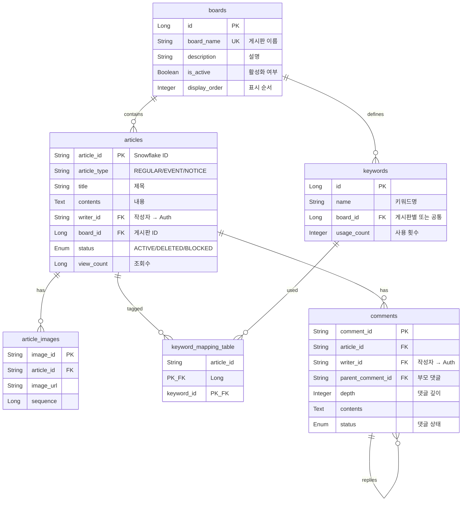
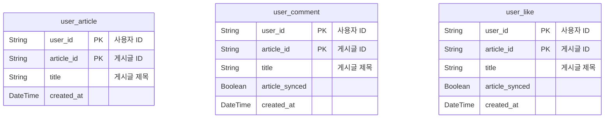

# Board/Community 도메인 (게시판/커뮤니티)

> 게시판, 게시글, 댓글, 좋아요, 사용자 활동을 관리하는 서비스

## 개요

| 서비스명            | 데이터베이스     | 특징                                |
|-----------------|------------|-----------------------------------|
| Article-server  | PostgreSQL | 게시글 관리 (Single Table Inheritance) |
| Comment-server  | PostgreSQL | 댓글/대댓글 관리                         |
| Activity-Server | PostgreSQL | 사용자 활동 기록 (좋아요, 작성글, 댓글)          |

---

## ERD



### Activity Server



---

## 테이블 상세

### boards (게시판)

| 필드              | 타입          | Null | 설명                 | 예시                 |
|-----------------|-------------|:----:|--------------------|--------------------|
| `id`            | Long        |  N   | PK, Auto Increment | `1`                |
| `board_name`    | String(50)  |  N   | 게시판 이름 (unique)    | `"자유게시판"`          |
| `description`   | String(200) |  Y   | 설명                 | `"자유롭게 이야기하는 게시판"` |
| `is_active`     | Boolean     |  N   | 활성화 여부             | `true`             |
| `display_order` | Integer     |  Y   | 표시 순서              | `1`                |
| `created_at`    | DateTime    |  N   | 생성일시               |                    |
| `updated_at`    | DateTime    |  N   | 수정일시               |                    |

---

### articles (게시글 - Single Table Inheritance)

> RegularArticle, EventArticle, NoticeArticle이 하나의 테이블에 저장됨

| 필드                 | 타입          | Null | 설명                      | 예시                   |
|--------------------|-------------|:----:|-------------------------|----------------------|
| `article_id`       | String(50)  |  N   | PK, Snowflake ID        | `"ART_20251025_001"` |
| `article_type`     | String      |  N   | 게시글 유형 (Discriminator)  | `"REGULAR"`          |
| `title`            | String(200) |  N   | 제목                      | `"첫 게시글"`            |
| `contents`         | Text        |  N   | 내용                      |                      |
| `writer_id`        | String(50)  |  N   | 작성자 ID (→ Auth)         | `"user_123"`         |
| `board_id`         | Long        |  N   | 게시판 ID (→ boards)       | `1`                  |
| `status`           | Enum        |  N   | 게시글 상태                  | `ACTIVE`             |
| `view_count`       | Long        |  N   | 조회수                     | `15`                 |
| `first_image_url`  | String(500) |  Y   | 대표 이미지 URL              |                      |
| `version`          | Long        |  N   | 낙관적 락 버전                |                      |
| `created_at`       | DateTime    |  N   | 생성일시                    |                      |
| `updated_at`       | DateTime    |  N   | 수정일시                    |                      |
| `event_start_date` | DateTime    |  Y   | 이벤트 시작일 (EventArticle만) |                      |
| `event_end_date`   | DateTime    |  Y   | 이벤트 종료일 (EventArticle만) |                      |

#### article_type (게시글 유형)

| 값         | 설명                 |
|-----------|--------------------|
| `REGULAR` | 일반 게시글             |
| `EVENT`   | 이벤트 게시글 (기간 정보 포함) |
| `NOTICE`  | 공지사항               |

#### Enum: Status (게시글 상태)

| 값         | 설명                |
|-----------|-------------------|
| `ACTIVE`  | 활성 (공개)           |
| `DELETED` | 삭제됨 (Soft Delete) |
| `BLOCKED` | 차단됨               |

---

### article_images (게시글 이미지)

| 필드           | 타입          | Null | 설명                  | 예시          |
|--------------|-------------|:----:|---------------------|-------------|
| `image_id`   | String      |  N   | 이미지 ID              | `"IMG_001"` |
| `article_id` | String(50)  |  N   | 게시글 ID (→ articles) |             |
| `image_url`  | String(500) |  N   | 이미지 URL             |             |
| `sequence`   | Long        |  N   | 이미지 순서              | `1`         |

---

### keywords (키워드)

| 필드            | 타입      | Null | 설명               | 예시       |
|---------------|---------|:----:|------------------|----------|
| `id`          | Long    |  N   | PK               |          |
| `name`        | String  |  N   | 키워드 이름           | `"Java"` |
| `board_id`    | Long    |  Y   | 게시판 ID (null=공통) | `1`      |
| `is_active`   | Boolean |  N   | 활성화 여부           | `true`   |
| `usage_count` | Integer |  N   | 사용 횟수            | `150`    |

---

### keyword_mapping_table (게시글-키워드 매핑)

| 필드           | 타입         | Null | 설명            |
|--------------|------------|:----:|---------------|
| `article_id` | String(50) |  N   | 복합 PK, 게시글 ID |
| `keyword_id` | Long       |  N   | 복합 PK, 키워드 ID |

---

### comments (댓글)

| 필드                  | 타입          | Null | 설명                  | 예시       |
|---------------------|-------------|:----:|---------------------|----------|
| `comment_id`        | String(100) |  N   | PK                  |          |
| `article_id`        | String(100) |  N   | 게시글 ID (→ articles) |          |
| `writer_id`         | String(100) |  N   | 작성자 ID (→ Auth)     |          |
| `parent_comment_id` | String(100) |  Y   | 부모 댓글 ID (null=최상위) |          |
| `root_comment_id`   | String(100) |  Y   | 스레드 루트 ID           |          |
| `depth`             | Integer     |  N   | 댓글 깊이 (0: 루트)       | `0`      |
| `contents`          | Text        |  N   | 내용                  |          |
| `is_deleted`        | Boolean     |  N   | 삭제 여부               | `false`  |
| `status`            | Enum        |  N   | 댓글 상태               | `ACTIVE` |
| `reply_count`       | Integer     |  N   | 답글 수                | `0`      |
| `created_at`        | Instant     |  N   | 생성일시                |          |
| `updated_at`        | Instant     |  N   | 수정일시                |          |
| `deleted_at`        | Instant     |  Y   | 삭제일시                |          |

#### Enum: CommentStatus (댓글 상태)

| 값                | 설명         | 표시 메시지          |
|------------------|------------|-----------------|
| `ACTIVE`         | 공개         | 원본 내용           |
| `HIDDEN`         | 신고/검토로 숨김  | "숨김 처리된 댓글입니다." |
| `BANNED`         | 정책 위반으로 차단 | "제재된 댓글입니다."    |
| `PENDING_REVIEW` | 검토 중       | "검토 중인 댓글입니다."  |
| `DELETED`        | 삭제됨        | "삭제된 댓글입니다."    |

---

## Activity Server 테이블

### user_article (사용자 작성 게시글)

| 필드           | 타입       | Null | 설명            |
|--------------|----------|:----:|---------------|
| `user_id`    | String   |  N   | 복합 PK, 사용자 ID |
| `article_id` | String   |  N   | 복합 PK, 게시글 ID |
| `title`      | String   |  Y   | 게시글 제목        |
| `version`    | Integer  |  N   | 버전            |
| `created_at` | DateTime |  N   | 생성일시          |

---

### user_comment (사용자 작성 댓글)

| 필드               | 타입       | Null | 설명            |
|------------------|----------|:----:|---------------|
| `user_id`        | String   |  N   | 복합 PK, 사용자 ID |
| `article_id`     | String   |  N   | 복합 PK, 게시글 ID |
| `title`          | String   |  Y   | 게시글 제목        |
| `version`        | Integer  |  N   | 버전            |
| `created_at`     | DateTime |  N   | 생성일시          |
| `article_synced` | Boolean  |  N   | 동기화 여부        |

---

### user_like (사용자 좋아요)

| 필드               | 타입       | Null | 설명            |
|------------------|----------|:----:|---------------|
| `user_id`        | String   |  N   | 복합 PK, 사용자 ID |
| `article_id`     | String   |  N   | 복합 PK, 게시글 ID |
| `title`          | String   |  Y   | 게시글 제목        |
| `version`        | Integer  |  N   | 버전            |
| `created_at`     | DateTime |  N   | 생성일시          |
| `article_synced` | Boolean  |  N   | 동기화 여부        |

---

## API Response

### ArticleResponse (게시글 조회)

```json
{
  "articleId": "ART_20251025_001",
  "title": "첫 게시글",
  "content": "안녕하세요 밴더입니다.",
  "writerId": "user_123",
  "writerName": "홍길동",
  "writerProfileImage": "https://cdn.example.com/profile.jpg",
  "status": "ACTIVE",
  "viewCount": 15,
  "board": {
    "boardId": 1,
    "boardName": "자유게시판",
    "description": "자유롭게 이야기하는 게시판"
  },
  "keywords": [
    {
      "keywordId": 1,
      "keywordName": "Java",
      "isCommon": true,
      "boardId": null,
      "boardName": null
    }
  ],
  "images": [
    {
      "imageId": "IMG_001",
      "imageUrl": "https://cdn.example.com/img1.webp",
      "sequence": 1
    }
  ],
  "firstImageUrl": "https://cdn.example.com/img1.webp",
  "eventStartDate": null,
  "eventEndDate": null,
  "createdAt": "2025-10-25T10:30:00",
  "updatedAt": "2025-10-25T10:30:00"
}
```

| 필드                   | 타입       | Null | 설명                    |
|----------------------|----------|:----:|-----------------------|
| `articleId`          | String   |  N   | 게시글 ID                |
| `title`              | String   |  N   | 제목                    |
| `content`            | String   |  N   | 내용                    |
| `writerId`           | String   |  N   | 작성자 ID                |
| `writerName`         | String   |  Y   | 작성자 이름 (Profile에서 조회) |
| `writerProfileImage` | String   |  Y   | 작성자 프로필 이미지           |
| `status`             | String   |  N   | 게시글 상태                |
| `viewCount`          | Integer  |  N   | 조회수                   |
| `board`              | Object   |  N   | 게시판 정보                |
| `keywords`           | List     |  Y   | 키워드 목록                |
| `images`             | List     |  Y   | 이미지 목록                |
| `firstImageUrl`      | String   |  Y   | 대표 이미지 URL            |
| `eventStartDate`     | DateTime |  Y   | 이벤트 시작일               |
| `eventEndDate`       | DateTime |  Y   | 이벤트 종료일               |
| `createdAt`          | DateTime |  N   | 생성일시                  |
| `updatedAt`          | DateTime |  N   | 수정일시                  |

---

### CommentResponse (댓글 조회)

```json
{
  "commentId": "CMT_001",
  "articleId": "ART_20251025_001",
  "writerId": "user_456",
  "parentCommentId": null,
  "rootCommentId": "CMT_001",
  "depth": 0,
  "contents": "좋은 글이네요!",
  "replyCount": 2,
  "createdAt": "2025-10-25T11:00:00",
  "replies": [],
  "isEdited": false,
  "visible": true
}
```

| 필드                | 타입      | Null | 설명               |
|-------------------|---------|:----:|------------------|
| `commentId`       | String  |  N   | 댓글 ID            |
| `articleId`       | String  |  N   | 게시글 ID           |
| `writerId`        | String  |  N   | 작성자 ID           |
| `parentCommentId` | String  |  Y   | 부모 댓글 ID         |
| `rootCommentId`   | String  |  Y   | 루트 댓글 ID         |
| `depth`           | Integer |  N   | 댓글 깊이            |
| `contents`        | String  |  N   | 내용 (상태에 따라 마스킹됨) |
| `replyCount`      | Integer |  N   | 답글 수             |
| `createdAt`       | Instant |  N   | 생성일시             |
| `replies`         | List    |  N   | 답글 목록            |
| `isEdited`        | Boolean |  N   | 수정 여부            |
| `visible`         | Boolean |  N   | 표시 여부            |

---

