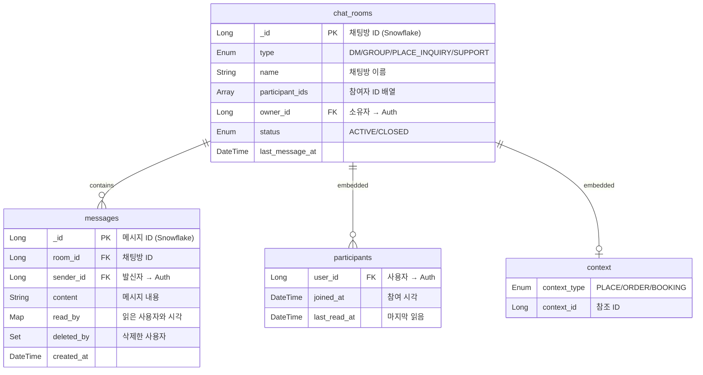

# Chat/Notification 도메인 (채팅/알림)

> 실시간 채팅, 공간 문의, 고객 지원, 푸시 알림을 관리하는 서비스

## 개요

| 서비스명                    | 데이터베이스  | 특징                           |
|-------------------------|---------|------------------------------|
| Chat-Server (ChatDDing) | MongoDB | 실시간 채팅, 1:1 DM, 공간 문의, 고객 지원 |
| Notification            | Redis   | 푸시 알림, 읽지 않은 메시지 카운트 캐싱      |

---

## ERD (MongoDB Collections)



---

## Collection 상세

### chat_rooms (채팅방)

| 필드                     | 타입            | Null | 설명                 | 예시           |
|------------------------|---------------|:----:|--------------------|--------------|
| `_id`                  | Long          |  N   | 채팅방 ID (Snowflake) | `1234567890` |
| `type`                 | Enum          |  N   | 채팅방 유형             | `DM`         |
| `name`                 | String        |  Y   | 채팅방 이름             | `"공간 문의"`    |
| `participants`         | Array         |  N   | 참여자 목록 (embedded)  |              |
| `participantIds`       | Array\<Long\> |  N   | 참여자 ID 배열 (인덱싱용)   | `[100, 200]` |
| `sortedParticipantIds` | Array\<Long\> |  N   | 정렬된 참여자 ID (중복 방지) |              |
| `ownerId`              | Long          |  N   | 소유자 ID (→ Auth)    | `100`        |
| `status`               | Enum          |  N   | 채팅방 상태             | `ACTIVE`     |
| `createdAt`            | DateTime      |  N   | 생성 시각              |              |
| `lastMessageAt`        | DateTime      |  Y   | 마지막 메시지 시각         |              |
| `context`              | Object        |  Y   | 컨텍스트 정보 (embedded) |              |

#### Enum: ChatRoomType (채팅방 유형)

| 값               | 설명        | 최대 참여자 |
|-----------------|-----------|--------|
| `DM`            | 1:1 개인 대화 | 2명     |
| `GROUP`         | 그룹 채팅     | 100명   |
| `PLACE_INQUIRY` | 공간 문의     | 2명     |
| `SUPPORT`       | 고객 상담     | 2명     |

#### Enum: ChatRoomStatus (채팅방 상태)

| 값        | 설명 |
|----------|----|
| `ACTIVE` | 활성 |
| `CLOSED` | 종료 |

---

### participants (참여자 - Embedded Document)

| 필드           | 타입       | Null | 설명              |
|--------------|----------|:----:|-----------------|
| `userId`     | Long     |  N   | 사용자 ID (→ Auth) |
| `joinedAt`   | DateTime |  N   | 참여 시각           |
| `lastReadAt` | DateTime |  Y   | 마지막 읽음 시각       |

---

### context (컨텍스트 - Embedded Document)

| 필드            | 타입   | Null | 설명      | 예시      |
|---------------|------|:----:|---------|---------|
| `contextType` | Enum |  N   | 컨텍스트 유형 | `PLACE` |
| `contextId`   | Long |  N   | 참조 ID   | `500`   |

#### Enum: ContextType (컨텍스트 유형)

| 값         | 설명    |
|-----------|-------|
| `PLACE`   | 공간 문의 |
| `ORDER`   | 주문 관련 |
| `BOOKING` | 예약 관련 |

---

### messages (메시지)

| 필드          | 타입                    | Null | 설명                 | 예시                             |
|-------------|-----------------------|:----:|--------------------|--------------------------------|
| `_id`       | Long                  |  N   | 메시지 ID (Snowflake) |                                |
| `roomId`    | Long                  |  N   | 채팅방 ID             |                                |
| `senderId`  | Long                  |  N   | 발신자 ID (→ Auth)    |                                |
| `content`   | String                |  N   | 메시지 내용             | `"안녕하세요"`                      |
| `readBy`    | Map\<Long, DateTime\> |  N   | 읽은 사용자와 시각         | `{100: "2026-01-12T10:00:00"}` |
| `deletedBy` | Set\<Long\>           |  N   | 삭제한 사용자            | `[100]`                        |
| `createdAt` | DateTime              |  N   | 생성 시각              |                                |

---

## Support (고객 지원)

### Enum: SupportStatus (지원 상태)

| 값             | 설명   |
|---------------|------|
| `WAITING`     | 대기 중 |
| `IN_PROGRESS` | 상담 중 |
| `CLOSED`      | 종료됨  |

---

## API Response

### ChatRoomResponse (채팅방 조회)

```json
{
  "roomId": "1234567890",
  "type": "DM",
  "name": null,
  "profileImage": "https://cdn.example.com/profile.jpg",
  "participants": [
    {
      "userId": "100",
      "nickname": "홍길동",
      "profileImage": "https://cdn.example.com/profile1.jpg"
    }
  ],
  "lastMessage": "안녕하세요!",
  "lastMessageAt": "2026-01-12T10:30:00",
  "unreadCount": 3,
  "context": null
}
```

| 필드              | 타입       | Null | 설명                  |
|-----------------|----------|:----:|---------------------|
| `roomId`        | String   |  N   | 채팅방 ID              |
| `type`          | Enum     |  N   | 채팅방 유형              |
| `name`          | String   |  Y   | 채팅방 이름              |
| `profileImage`  | String   |  Y   | 대표 프로필 이미지          |
| `participants`  | List     |  N   | 참여자 정보 (Profile 병합) |
| `lastMessage`   | String   |  Y   | 마지막 메시지             |
| `lastMessageAt` | DateTime |  Y   | 마지막 메시지 시각          |
| `unreadCount`   | Long     |  N   | 읽지 않은 메시지 수         |
| `context`       | Object   |  Y   | 컨텍스트 정보             |

---

### MessageResponse (메시지 조회)

```json
{
  "messageId": "9876543210",
  "roomId": "1234567890",
  "sender": {
    "userId": "100",
    "nickname": "홍길동",
    "profileImage": "https://cdn.example.com/profile.jpg"
  },
  "content": "안녕하세요!",
  "readCount": 1,
  "deleted": false,
  "createdAt": "2026-01-12T10:30:00"
}
```

| 필드          | 타입       | Null | 설명                  |
|-------------|----------|:----:|---------------------|
| `messageId` | String   |  N   | 메시지 ID              |
| `roomId`    | String   |  N   | 채팅방 ID              |
| `sender`    | Object   |  N   | 발신자 정보 (Profile 병합) |
| `content`   | String   |  N   | 메시지 내용              |
| `readCount` | Integer  |  N   | 읽은 사람 수             |
| `deleted`   | Boolean  |  N   | 삭제 여부               |
| `createdAt` | DateTime |  N   | 생성 시각               |

---

## MongoDB 인덱스

### chat_rooms

| 인덱스 이름                             | 필드                              | 용도        |
|------------------------------------|---------------------------------|-----------|
| `idx_type_participantIds`          | `type, sortedParticipantIds`    | DM 중복 방지  |
| `idx_participantIds_lastMessageAt` | `participantIds, lastMessageAt` | 채팅방 목록 조회 |

### messages

| 인덱스 이름                 | 필드                       | 용도      |
|------------------------|--------------------------|---------|
| `idx_roomId_createdAt` | `roomId, createdAt DESC` | 메시지 페이징 |

---
