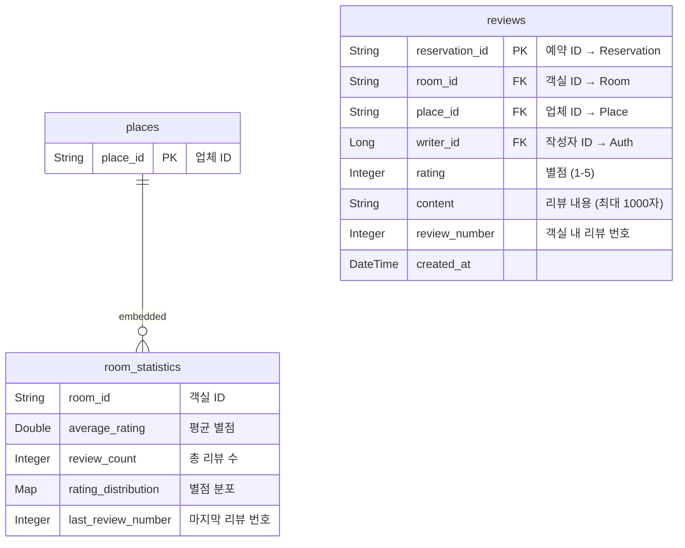
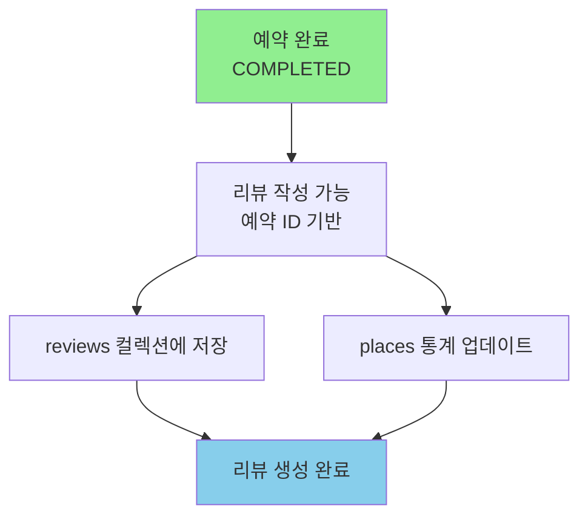

# Review/Support 도메인 (리뷰/지원)

> 리뷰 작성, 별점 관리, 통계, 고객 지원을 관리하는 서비스

## 개요

| 서비스명                  | 데이터베이스  | 특징           |
|-----------------------|---------|--------------|
| REVIEW_SERVICE_SERVER | MongoDB | 리뷰 관리, 별점 통계 |

---

## ERD (MongoDB Collections)



---

## Collection 상세

### reviews (리뷰)

> 리뷰는 생성 후 수정 불가능 (immutable)

| 필드              | 타입       | Null | 설명                        | 예시            |
|-----------------|----------|:----:|---------------------------|---------------|
| `reservationId` | String   |  N   | PK, 예약 ID (→ Reservation) | `"RES_123"`   |
| `roomId`        | String   |  N   | 객실 ID (→ Room)            | `"ROOM_456"`  |
| `placeId`       | String   |  N   | 업체 ID (→ Place)           | `"PLACE_789"` |
| `writerId`      | Long     |  N   | 작성자 ID (→ Auth)           | `100`         |
| `rating`        | Integer  |  N   | 별점 (1-5)                  | `5`           |
| `content`       | String   |  N   | 리뷰 내용 (최대 1000자)          | `"정말 좋았습니다!"` |
| `reviewNumber`  | Integer  |  N   | 객실 내 리뷰 번호                | `15`          |
| `createdAt`     | DateTime |  N   | 생성 시각                     |               |

#### rating 유효성 검증

- 최소값: 1
- 최대값: 5
- 정수만 허용

#### content 유효성 검증

- 빈 문자열 불가
- 최대 1000자

---

### places (업체 통계)

| 필드        | 타입     | Null | 설명                  | 예시            |
|-----------|--------|:----:|---------------------|---------------|
| `placeId` | String |  N   | PK, 업체 ID           | `"PLACE_789"` |
| `rooms`   | Array  |  N   | 객실 통계 목록 (embedded) |               |

---

### RoomStatistics (객실 통계 - Embedded Document)

| 필드                   | 타입      | Null | 설명              | 예시                                   |
|----------------------|---------|:----:|-----------------|--------------------------------------|
| `roomId`             | String  |  N   | 객실 ID           | `"ROOM_456"`                         |
| `averageRating`      | Double  |  N   | 평균 별점 (소수점 1자리) | `4.5`                                |
| `reviewCount`        | Integer |  N   | 총 리뷰 수          | `150`                                |
| `ratingDistribution` | Map     |  N   | 별점별 개수 분포       | `{1: 5, 2: 10, 3: 25, 4: 50, 5: 60}` |
| `lastReviewNumber`   | Integer |  N   | 마지막 리뷰 번호       | `150`                                |

---

## 통계 계산

### Place 전체 통계 (PlaceStatistics)

| 필드                     | 타입      | 설명                 |
|------------------------|---------|--------------------|
| `placeId`              | String  | 업체 ID              |
| `totalReviewCount`     | Integer | 전체 리뷰 수 (모든 객실 합산) |
| `overallAverageRating` | Double  | 전체 평균 별점 (가중 평균)   |

#### 가중 평균 계산 공식

```
overallAverageRating = Σ(room.averageRating × room.reviewCount) / totalReviewCount
```

---

## API Response

### ReviewResponse (리뷰 조회)

```json
{
  "reservationId": "RES_123",
  "roomId": "ROOM_456",
  "placeId": "PLACE_789",
  "writerId": 100,
  "rating": 5,
  "content": "정말 좋았습니다! 다음에도 이용할게요.",
  "reviewNumber": 15,
  "createdAt": "2026-01-12T15:30:00"
}
```

| 필드              | 타입       | Null | 설명            |
|-----------------|----------|:----:|---------------|
| `reservationId` | String   |  N   | 예약 ID (리뷰 ID) |
| `roomId`        | String   |  N   | 객실 ID         |
| `placeId`       | String   |  N   | 업체 ID         |
| `writerId`      | Long     |  N   | 작성자 ID        |
| `rating`        | Integer  |  N   | 별점 (1-5)      |
| `content`       | String   |  N   | 리뷰 내용         |
| `reviewNumber`  | Integer  |  N   | 리뷰 번호         |
| `createdAt`     | DateTime |  N   | 생성 시각         |

---

### RoomStatisticsResponse (객실 통계)

```json
{
  "roomId": "ROOM_456",
  "averageRating": 4.5,
  "reviewCount": 150,
  "ratingDistribution": {
    "1": 5,
    "2": 10,
    "3": 25,
    "4": 50,
    "5": 60
  }
}
```

---

### PlaceStatisticsResponse (업체 통계)

```json
{
  "placeId": "PLACE_789",
  "totalReviewCount": 500,
  "overallAverageRating": 4.3,
  "rooms": [
    {
      "roomId": "ROOM_456",
      "averageRating": 4.5,
      "reviewCount": 150
    },
    {
      "roomId": "ROOM_457",
      "averageRating": 4.2,
      "reviewCount": 350
    }
  ]
}
```

---

## 리뷰 작성 흐름



---

## 특이사항

1. **예약 기반 리뷰**: 리뷰 ID는 예약 ID(reservationId)를 사용합니다. 하나의 예약에는 하나의 리뷰만 작성 가능합니다.

2. **불변 리뷰**: 리뷰는 생성 후 수정이 불가능합니다 (immutable pattern).

3. **통계 자동 갱신**: 리뷰 작성 시 해당 객실과 업체의 통계가 자동으로 갱신됩니다.

4. **가중 평균**: 업체 전체 평균은 각 객실의 리뷰 수를 가중치로 사용한 가중 평균입니다.

---

## 이전 문서

← [06_chat_notification.md](./06_chat_notification.md) - 채팅/알림 도메인
